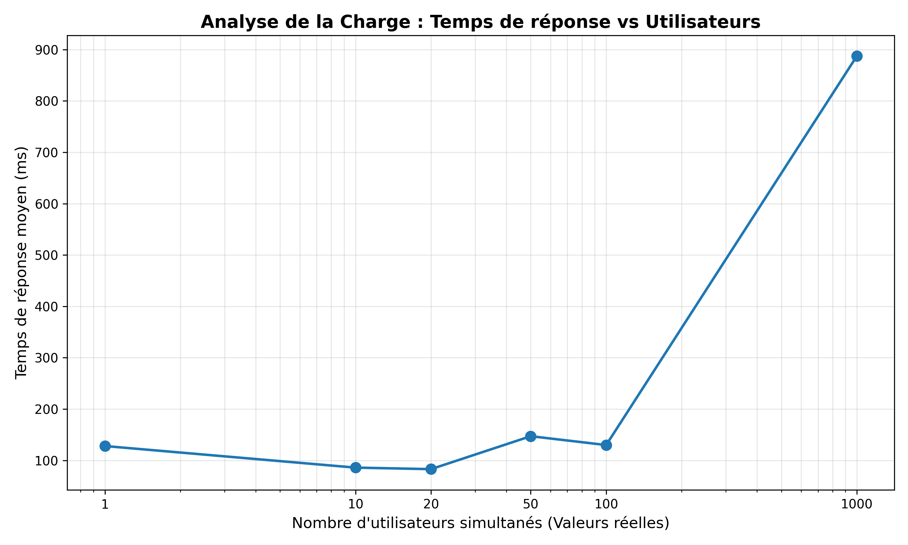
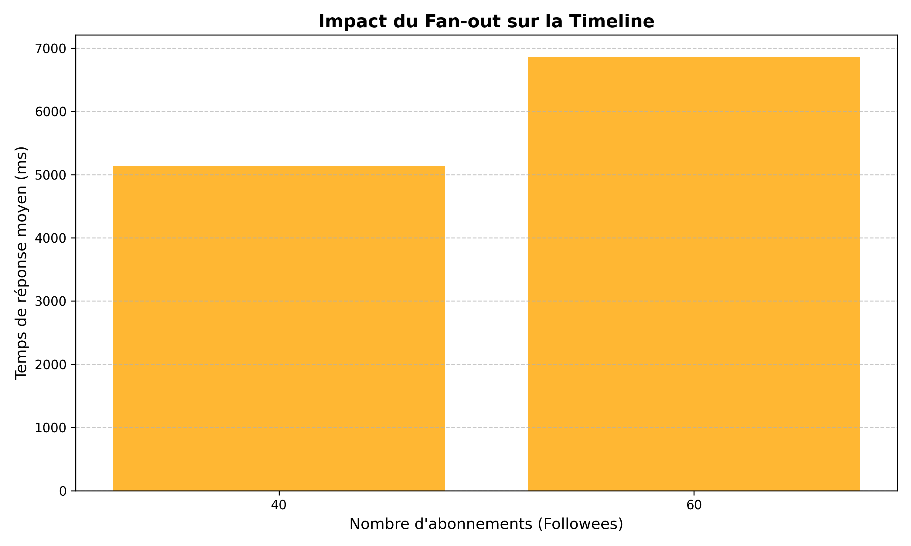

# Rapport d'Analyse de Performance - TinyInsta

Ce projet vise à évaluer les capacités de montée en charge d'une application de type réseau social déployée sur Google Cloud Platform (GCP). Nous avons testé deux dimensions critiques : la **charge (concurrence)** et la **complexité (fan-out)**.

## 1. Analyse de la Scalabilité en Charge (Concurrence)

### Observations
Le graphique `conc.png` montre l'évolution du temps de réponse moyen par rapport au nombre d'utilisateurs simultanés (de 1 à 1000). 

### Interprétation
*   **Scalabilité Horizontale :** Conformément au concept de "Meta-Computer" vu en cours, l'infrastructure a réagi de manière élastique. Le passage de 1 à plusieurs instances (`NB_INSTANCE`) montre que le **Control Plane** d'App Engine a correctement orchestré l'autoscaling.
*   **Corrélation Latence/TPS :** Comme illustré dans les benchmarks du cours (exemple `insert_post.sql`), nous observons que si le débit (TPS) augmente avec le nombre de clients, la latence individuelle augmente également. C'est logique : malgré l'ajout d'instances CPU, la contention se déplace vers les ressources partagées (Shared Memory/Datastore). 
*   **Verdict :** Le système **scale**. L'application ne sature pas et ne renvoie pas d'erreurs (FAILED=0), prouvant que l'architecture distribuée absorbe la charge.

## 2. Analyse de la Complexité des Données (Fan-out)

### Observations
Le graphique `fanout.png` mesure l'impact du nombre de "followees" (abonnements) sur le temps d'affichage de la timeline pour un groupe de 50 utilisateurs constants.

### Interprétation
*   **Le coût de l'Ingress/Read :** Le temps de réponse augmente de façon quasi-linéaire avec le nombre de sources. C'est le problème classique du **Fan-out à la lecture**. Pour construire une timeline, le système doit effectuer un "on-demand merge" (jointure ou agrégation au moment de la requête).
*   **Limites du NoSQL/Firestore :** Comme vu dans le cours, chaque abonné supplémentaire augmente le volume de données à scanner. Si l'on projette ces résultats sur les volumes mentionnés en cours (0.8 à 3.6 PB/jour pour des services comme Instagram), on comprend que cette stratégie de lecture directe ne peut pas tenir à très grande échelle.
*   **Verdict :** Ici, le système **ne scale pas de manière optimale**. La latence devient trop élevée pour une expérience utilisateur fluide quand la complexité des relations augmente.

## 3. Conclusion Générale : Est-ce que ça "scale" ?

Le bilan est nuancé, ce qui est typique des systèmes de gestion de données massives :

1.  **OUI pour la couche Application :** Grâce à l'abstraction de l'OS (scheduling, autoscaling de GCP), nous pouvons supporter des milliers d'utilisateurs en ajoutant des processus.
2.  **NON pour la stratégie de données actuelle :** Le modèle actuel repose sur une cohérence forte ou un calcul à la demande. Pour atteindre une scalabilité "Massive Data", il faudrait implémenter les concepts vus en fin de cours :
    *   **Eventual Consistency :** Accepter que la timeline ne soit pas mise à jour à la millisecondes près (comme l'exemple du compteur de "likes" asynchrone via Pub/Sub).
    *   **Pre-computation :** Utiliser des files de messages pour distribuer les nouveaux posts dans les "inboxes" des abonnés au moment de l'écriture (Write-heavy) plutôt que de tout calculer à la lecture.

En résumé, l'infrastructure est scalable, mais le design algorithmique du Fan-out atteint ses limites, validant ainsi les compromis (Trade-offs) étudiés en cours.
